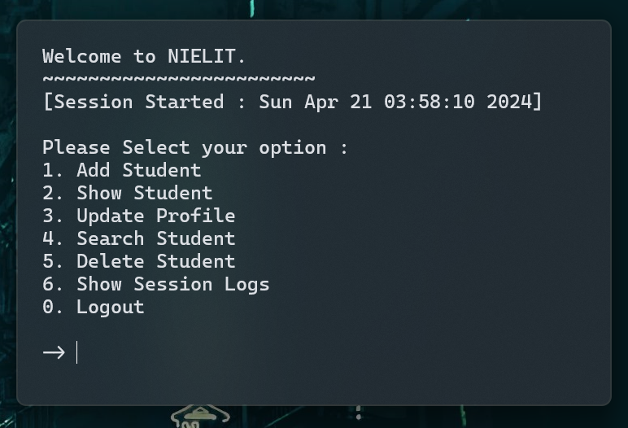
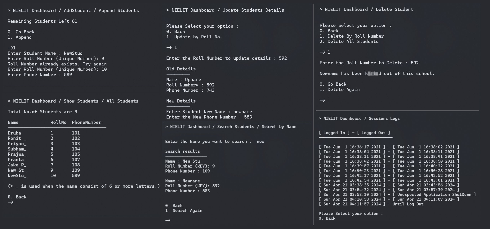

# Student Management System

This is an CLI application for managing students, implemented in C and flat-file system 



## Features

- **Flat-File Database**: The system uses a flat-file database to store data, for smaller projects like this it improves data consistency and a higher retrieval efficiency.
- **Add Student**: Offers the ability to add multiple students in one go, append a single student to the end of the list, or insert a student at any chosen position, providing comprehensive control over student data entry.
- **Show Student**: Enables viewing the entire student database or a specific range of students, ensuring quick access to student records.
- **Update Profile**: Facilitates the updating of student profiles based on roll number, allowing for easy maintenance and accuracy of student data.
- **Search Student**: Incorporates an efficient linear search to find students by name, roll number, or phone number, optimizing the search process with a time complexity of O(n).
- **Delete Students**: Allows for the deletion of student records either individually by roll number or in bulk, enhancing data management flexibility.
- **Session Management**: Monitors user session activity, including login times and any unexpected events, ensuring a secure and reliable system operation.

<br>



## Getting Started

These instructions will get you a copy of the project up and running on your local machine for development and testing purposes.

### Prerequisites

- A C/C++ compiler (GCC recommended)
- Basic knowledge of C programming

### Installing

1. Clone the repository to your local machine.
   
   ```{bash}
   git clone https://github.com/unknown009d/StudentManagement.git
   ```
3. Navigate to the project directory.
   
   ```{bash}
   cd StudentManagement
   ```
5. Compile the project using your C++ compiler.

   ```{bash}
   gcc main.c
   ```
6. Run the compiled file.
   
   ```{bash}
   ./a.out
   ```

## Usage

After running the compiled file, follow the prompts in the command line to use the Student management system.
